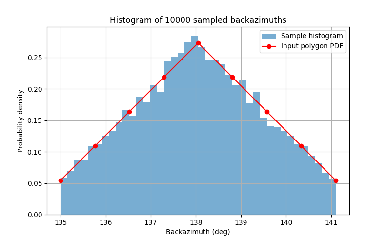

# single_array_PS_locate
A python program to estimate the location of seismic events given probability distributions for P1 and S1 arrival times and backazimuth from a seismic station  

Let's assume that we have a traveltime table file (e.g. **ak135_P1_S1_zerodepth.txt**) with a format as follows:  
```
# Columns: P1_travel_time  S1_travel_time  (S1-P1)  distance_deg  depth_km
0.000000        0.000000        0.000700        0.00    0.00
3.834300        6.427500        2.593200        0.20    0.00
7.668600        12.854900       5.186300        0.40    0.00
11.502900       19.282300       7.779400        0.60    0.00
15.337100       25.709600       10.372500       0.80    0.00
19.171300       32.136900       12.965600       1.00    0.00
23.005400       38.564000       15.558600       1.20    0.00
26.774600       44.991000       18.216400       1.40    0.00
29.525300       50.877900       21.352600       1.60    0.00
```

then, given an S-minus-P traveltime difference, we can calculate the distance from a station using:  
```
python find_dist_from_table.py ak135_P1_S1_zerodepth.txt 32.12
```
and this will calculate the distance in degrees given an S-minus-P time of 32.12 seconds ...  
```
P_travel_time = 43.075901
S_travel_time = 75.195901
S_minus_P     = 32.120000
Distance_deg  = 2.585275
```
This appears to fit well with our table.    

We now also need to define a probability distribution for backazimuth from our station.  
We do this in the form of a single file, e.g. **sig1_backazi_distr.txt**  
```
135.0  141.1
0.1
0.2
0.3
0.4
0.5
0.4
0.3
0.2
0.1
```
where the first line gives the min and max values of backazimuth and the following lines
give that values at equally spaced points in this interval, including the extreme values.
So typing  
```
python test_azi_distr.py sig1_backazi_distr.txt 10000
```
should result in a plot resembling the output in the image below  

  


